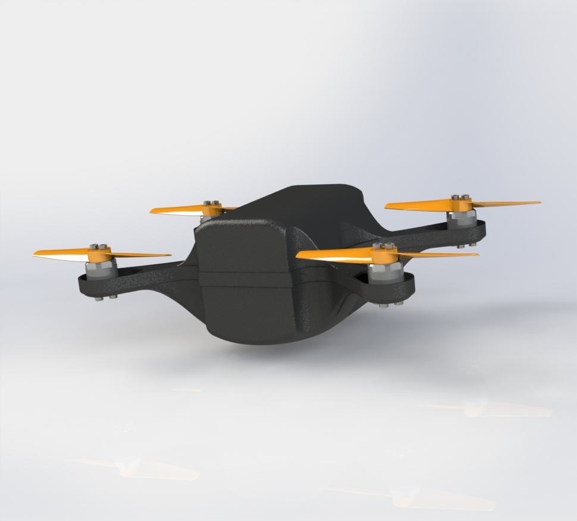
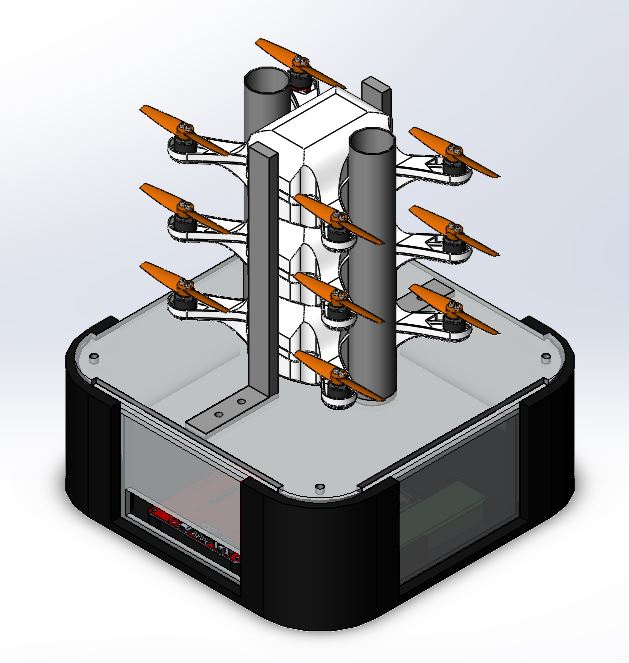

# Automatic Takeoff

Bachelor thesis spring 2021, University of Agder.

Supervisor: Kristian Muri Knausgård.

Authors: Jan-Henrik Skogstad, Martin Dahlseng Hermansen, Martin Mæland.

## Drone
The drone is based on earlier theses.

## Deployment system

